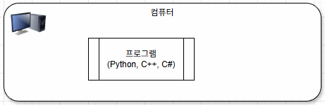
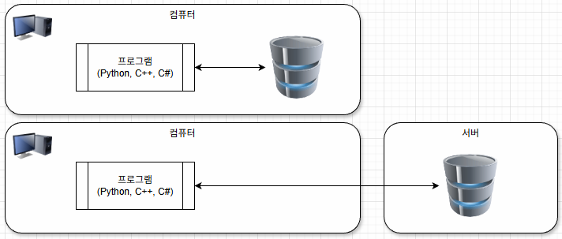
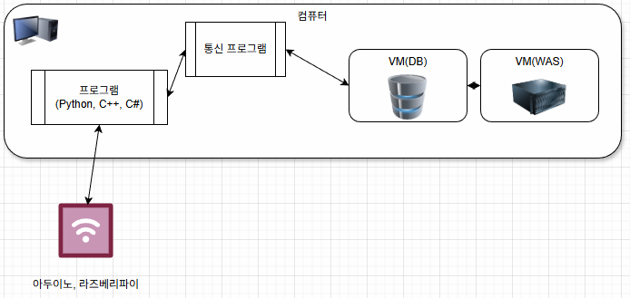

# pre-learning-2026
IoT개발자 과정 사전학습 리포지토리

## 1일 차
과정소개


학습 리포지토리 생성

- 마크다운 학습
  1. 제목
      ```markdown
      #  제목1
      ##  제목2
      ###  제목3
      ####  제목4
      #####  제목5
      ######  제목6 (잘 사용 안함)
      <!-- 주석(HTML주석 동일) -->
      ```

  2. 목록
      ```markdown
      - 목록
      * 목록
      1.  숫자목록
      2.  숫자목록
      ```
  3. 링크, 이미지
     ```markdown
     [네이버](https://naver.com)

     

     ## 사이즈 조절 이미지
     src : 이미지URL
     width : 이미지넓이 픽셀단위 지정
     
     ```
     - [네이버](https://naver.com)
    
     - 
       
     - 
     - 이미지와 링크의 차이는 !로 시작하는지 밖에 없음
     
     - 

  4. 가로줄
     ```markdown
     ---
     ```
  ---
  5. 코드블럭
     - 소스코드를 작성할 때 코드하이라이팅, 영역표시 때 사용
     - 백틱(`)을 세번 후 표시언어를 입력 또는 한번(인라인 코드블럭)
     ```python
     print('hello,python!')
     ```
     - 일반적인 문장에서 한 단어를 강조하고 싶을 때 `인라인 코드블럭`을 사용

  6. 강조 및 밑줄
     ```markdown
     *,~,_html u 태그사용, i 이탤릭
     ```
     - 문장을 작성할 시 **강조**, ~~취소선~~, __강조2__, <u>밑줄</u>, <i>이탤릭</i> 을 사용할 수 있습니다.
       

  - 깃허브 로컬리포지토리 생성
    1. git for window 설치
       - https://git-scm.com/ 에서 `install for window` 버튼 클릭
       - git for windows/x64 setup 클릭
       - git 설치 옵션 기본 그대로 사용 가능 ( 변경하지 말 것)
       - cmd 또는 powershell 에서 `git --version`,`git -v` 확인
    3. Github Desktop 설치
       - https://desktop.github.com/download/ 에서 다운로드 클릭, 설치
       - 계정 브라우저 연동
    4. 리포지토리 클론
       -  github desktop 메뉴 clone repository 클릭
       -  gitgub.com 탭에서 저장소 검색, 선택
       -  Local Path 지정 후 클론 버튼 클릭
      
- Visual Studio Code 설치
  1. https://code.visualstudio.com/docs/?dv=win64user 다운로드 클릭
  2. 설치 `C:\DEV\IDE\Microsoft VS Code`에 설치
  3. Extensions > Korean Pack for Visual Studio Code 설치 후 재시작

- 추가 설치 프로그램
  1. Notepad++ 에디터 - https://notepad-plus-plus.org/downloads/
  2. 픽픽 - https://picpick.net/
 
- **파이썬** 개발환경 설정
  1. https://www.python.org/ 에서 Download의 python 3.1x.x 버튼 클릭
  2. Add python.exe to PATH 체크 활성화 후 
  3. Installer > Customize installation 클릭
  4. Documentation 체크 해제, for all users 체크 활성화
  5. advanced options 에서 install python 3.1x for all users 체크
  6. 경로 변경 후 설치
     
     
  7. setup was successful 에서 disable path length limit 클릭(필수)
     
  8. cmd 또는 powershell 오픈, `python --version` 실행
  9. VS Code,Exension에서 python을 검색, 설치
  10. VS Code를 재오픈 폴더 생성

## 2일차
- VS Code 설정
   1. 미니맵 설정 : 설정 > 미니맵 검색, 
      - editor > Minimap : Enabled 체크 해제
   2. 폰트 지정 
      - 나눔고딕코딩,D2Coding 등 한글지원 코딩글자체 사용
      - https://github.com/naver/nanumfont
      - 설정 > Editor : font family 맨앞에, NanumGothicCoding 입력

   3. Mouse Wheel Zoom : 활성화

- https://app.diagrams.net/ 무료 다이어그램 사이트

- 프로그램 개발 개념
   - 프로그램 : 데이터를 처리하는 명령을 수행하는 것 (미리보기 ctrl shift v)
      - 단순 버전 : 데이터를 직접 처리하는 프로그램
         
      - DB사용구조 : 데이터를 DB에서 저장, 프로그램에서 데이터 처리(전송 및 표현)
         
         - DB가 같은 컴퓨터에 존재할 수도 있고, 다른 컴퓨터(서버)에 존재할 수 있음
      - IoT확장구조 : 데이터는 IoT에서 수집, 통신프로그램도 분리, 서버도 분리
         
         - 클라우드나 가상머신을 사용할 수도 있음


   - 학습할 언어, 기술
      - C,C++
      - Database(MySQL) : IoT장비와 같이 사용하기 위함
      - Python
      - C# : winApp,WebApp(HTML,JS),Iot 모니터링,DB처리
      - Linux : ROS,라즈베리파이 OS
      - 네트워크 통신, IoT, 데이터분석(ML,DL), 알고리즘,코딩테스트

   - Python
      - 기본문법
         - 변수와 자료형
         - 제어문(조건문,반복문)
         - 함수(또는 메서드)
         - 파일 입출력
         - 객체지향
         - 예외처리

      - 변수와 자료형
         - [변수](./day02/variable.py) 확인
         - [자료형](./day02/datatype.py) 확인

      - 제어문
         - [if문](./day02/if_statement.py) 확인
         - [while문](./day02/while_statement.py) 확인
         - [for문](./day02/for_statement.py) 확인

 ## 3일차
   - 파이썬
      -함수     